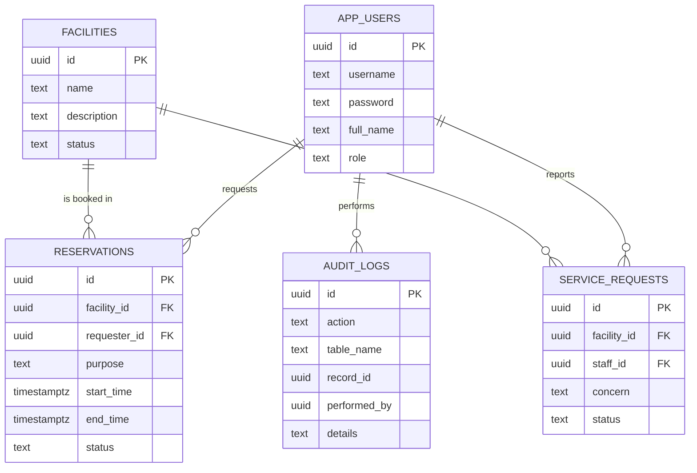
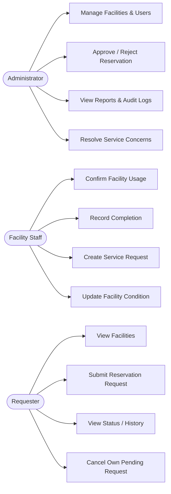

# Role-Based Facility Reservation and Approval System
SAD Laboratory 4 — Section B

Vanilla JavaScript (HTML/CSS/JS) + Supabase (PostgreSQL). No frontend framework, no build step.

---

## 1. Setup

### a) Create the Supabase project
1. Go to [supabase.com](https://supabase.com) → New Project.
2. Once ready, open **SQL Editor → New query**, paste the entire contents of `sql/schema.sql`, and run it.
   This creates all tables, permissive RLS policies (see note below), and seed data.
3. Go to **Project Settings → API** and copy your **Project URL** and **anon public key**.
4. Open `js/supabaseClient.js` and paste them in:
   ```js
   const SUPABASE_URL = "https://xxxxxxxx.supabase.co";
   const SUPABASE_ANON_KEY = "eyJ...";
   ```

### b) Run locally
Just open `index.html` in a browser, or serve the folder with any static server (e.g. VS Code "Live Server").

### c) Deploy to GitHub Pages
1. Push this folder to a GitHub repository.
2. Repo → **Settings → Pages** → Deploy from branch → `main` / root.
3. Your live URL will be `https://<username>.github.io/<repo>/`.

### Demo accounts (seeded by schema.sql)
| Role | Username | Password |
|---|---|---|
| Administrator | `admin` | `admin123` |
| Facility Staff | `staff` | `staff123` |
| Requester | `juan` | `juan123` |

New requesters can also self-register from the login page.

> **Security note:** Authentication here is a simple username/password lookup against a custom `app_users` table (not Supabase Auth), and Row Level Security is left permissive so the anon key can read/write freely. Role and business-rule enforcement happens in the JavaScript layer. This matches the lab's 3-hour scope (roles, workflow, business rules, audit trail). For a production system, you'd switch to Supabase Auth with per-role RLS policies instead of client-side checks.

---

## 2. Role-Permission Matrix

| Function | Administrator | Facility Staff | Requester |
|---|:---:|:---:|:---:|
| View facilities | ✅ | ✅ | ✅ |
| Add / delete facilities | ✅ | ❌ | ❌ |
| Update facility condition/status | ✅ | ✅ | ❌ |
| Submit reservation request | ❌ | ❌ | ✅ |
| Approve / reject reservation | ✅ | ❌ | ❌ |
| Confirm facility usage (→ In Use) | ❌ | ✅ | ❌ |
| Record completion (→ Completed) | ❌ | ✅ | ❌ |
| Cancel own Pending request | ❌ | ❌ | ✅ |
| View reservation status / history | ✅ (all) | ✅ (all) | ✅ (own) |
| Create service concern | ❌ | ✅ | ❌ |
| Resolve service concern | ✅ | ❌ | ❌ |
| Manage user accounts | ✅ | ❌ | ❌ |
| View audit logs | ✅ | ❌ | ❌ |

---

## 3. Reservation Workflow

```
Requester submits → Pending
                       │
              Administrator Review
                       │
            ┌──────────┴──────────┐
        Approved                Rejected  (terminal — cannot become Scheduled)
            │
       Scheduled  (slot is now reserved; conflicts blocked)
            │
     Facility Staff confirms usage
            │
         In Use
            │
     Facility Staff records completion
            │
        Completed  (terminal — cannot be edited)

A Requester may Cancel their own request only while it is Pending.
```

Implementation note: in this app, "Approve" moves a reservation directly from **Pending → Scheduled** (combining the Approved/Scheduled states from the spec into one action), since approval is exactly the moment the time slot becomes reserved.

---

## 4. Business Rules (as implemented)

| ID | Rule | Where enforced |
|---|---|---|
| BR-B4-01 | Only Active facilities may be reserved | `submitReservation()` checks `facility.status === "Active"` |
| BR-B4-02 | Start time must precede end time | Checked in `submitReservation()` and by a DB `check` constraint |
| BR-B4-03 | Overlapping approved schedules are prohibited | `hasConflict()` checks Approved/Scheduled/In Use reservations, called on submit and again on approve |
| BR-B4-04 | Only Administrator may approve | Approve/Reject buttons only rendered for the Administrator role |
| BR-B4-05 | Rejected reservations cannot become Scheduled | No approve action is ever offered once status is Rejected |
| BR-B4-06 | Approved reservations reserve the time slot | Approving sets status to Scheduled, which then blocks conflicting submissions |
| BR-B4-07 | Completed reservations cannot be edited | No action buttons are rendered once status is Completed |
| BR-B4-08 | Facilities under Maintenance cannot be reserved | Same Active-only check as BR-B4-01 (Maintenance/Inactive facilities are excluded from the reservation dropdown) |
| BR-B4-09 | Requesters may modify only their own Pending requests | `cancelReservation()` checks `requester_id` and `status === "Pending"` |
| BR-B4-10 | Approval and status changes must be logged | `logAction()` is called from every state-changing function into `audit_logs` |

---

## 5. ERD (Mermaid — paste into [mermaid.live](https://mermaid.live) or a Markdown viewer that renders Mermaid to export as an image)



## 6. Use Case Diagram (Mermaid flow representation)



---

## 7. Functional Test Results (fill in after testing against `sql/schema.sql` seed data)

| Test ID | Scenario | Expected Result | Actual Result | Pass/Fail |
|---|---|---|---|---|
| TC-B4-01 | Requester submits reservation | Saved as Pending | | |
| TC-B4-02 | Submit overlapping schedule | Conflict detected and blocked | | |
| TC-B4-03 | Administrator approves request | Status becomes Approved/Scheduled | | |
| TC-B4-04 | Administrator rejects request | Status becomes Rejected | | |
| TC-B4-05 | Staff marks facility In Use | Status updated | | |
| TC-B4-06 | Staff completes reservation | Status becomes Completed | | |
| TC-B4-07 | Requester edits another user's request | Blocked | | |
| TC-B4-08 | Reserve facility under maintenance | Blocked | | |
| TC-B4-09 | Check audit log | Approval/status log visible | | |
| TC-B4-10 | Open protected page without login | Access denied | | |

For TC-B4-10: `dashboard.html` calls `requireAuth()` on load, which redirects to `index.html` immediately if no session exists — try opening `dashboard.html` directly in a private/incognito window to demonstrate this.

---

## 8. Project Structure

```
facility-reservation-system/
├── index.html          # Login + Requester self-registration
├── dashboard.html       # Role-based app shell (tabs render per role)
├── css/style.css        # Green & white theme
├── js/
│   ├── supabaseClient.js  # ⚠️ put your URL + anon key here
│   ├── auth.js
│   ├── audit.js
│   ├── facilities.js
│   ├── reservations.js
│   ├── serviceRequests.js
│   └── app.js             # UI controller, tabs, tables, modals
├── sql/schema.sql       # Tables, RLS policies, seed data
└── README.md
```
